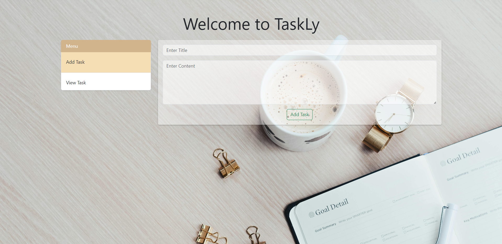
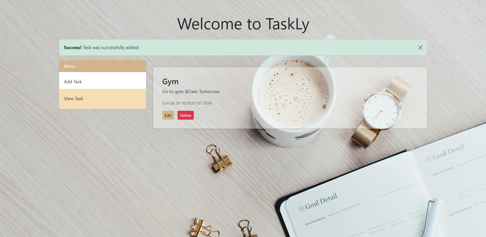
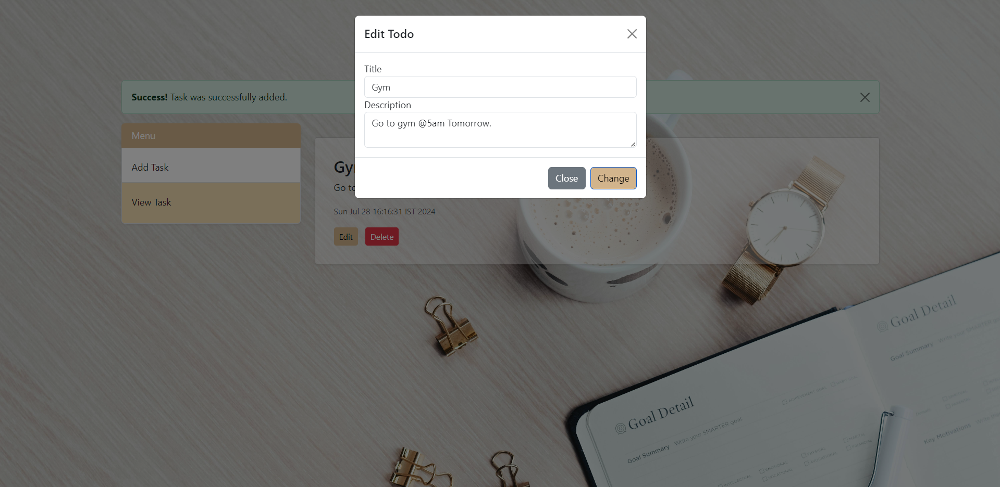
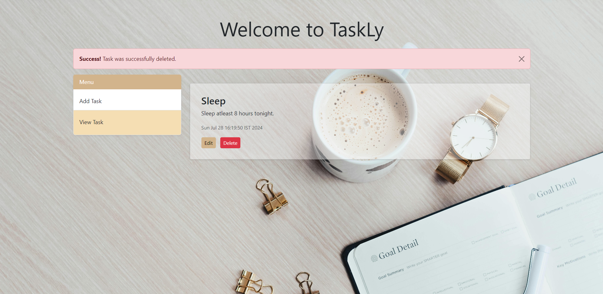

# TaskLy 📝

A full-stack app for efficient task management and organization


## Author 🧔‍♂️

- [@akshat](https://www.github.com/akshatg02/)

## Deployment 🚀

To deploy this project
- Install Maven
- Build the Project
  ```bash
  mvn clean install
  ```
- Configure Apache Tomcat. 
  Then run,
  ```bash
  http://localhost:8080/TaskLy/
  ```


## Features ⚙️

- Create Task
- Read all Tasks
- Update any Task
- Delete any Task
- Simple UI
- Session Management

## About Me 🔥
I'm a Full stack Developer.

## 🔗 Links
[](https://www.linkedin.com/in/akshat-garg-9021a8225/)


## 🛠 Skills
Html, CSS, JS, JSP, Servlet, Spring MVC.


## Tech Stack

**Client:** HTML, CSS, JSP

**Server:** Servlet, Spring MVC


## Screenshots 📷





